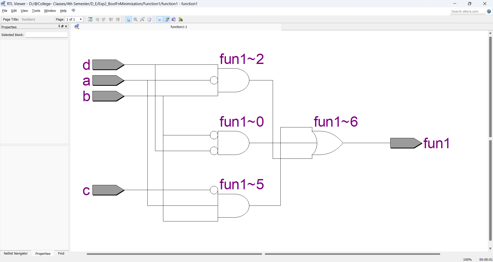

# BOOLEAN_FUNCTION_MINIMIZATION

**AIM:**

To implement the given logic function verify its operation in Quartus using Verilog programming.

F1= A’B’C’D’+AC’D’+B’CD’+A’BCD+BC’D 

F2=xy’z+x’y’z+w’xy+wx’y+wxy

**Equipment Required:**

Hardware – PCs, Cyclone II , USB flasher

**Software – Quartus prime**

**Theory**

Boolean Algebra is a branch of algebra that deals with boolean values-true and false.It is fundamental to digital logic design and computer science,providing a mathamatical framework for describing logical operation and expressions.

**Logic Diagram**

1.F1


2.F2


**Boolean Function Minimization**

1.F1


2.F2


**Procedure**

1.	Type the program in Quartus software.

2.	Compile and run the program.

3.	Generate the RTL schematic and save the logic diagram.

4.	Create nodes for inputs and outputs to generate the timing diagram.

5.	For different input combinations generate the timing diagram.


**Program:**

1.F1

```verilog
module function1(a,b,c,d,fun1);
input a,b,c,d;
output fun1;
assign fun1=((~b & ~d)|(~a & b & d)|(a & b & ~c));
endmodule
```

2.F2

```verilog
module function2(w,x,y,z,fun2);
intput w,x,y,z;
output fun2;
assign fun2=((~y & z)|(w & y)|(x &y));
endmodule
```
```
Developed by    : Santhosh T
Register Number : 212223220100
```
**RTL**

1.F1



2.F2


**Timing Diagram**

1.F1


2.F2


**Result:**

Thus the given logic functions are implemented using and their operations are verified using Verilog programming.

